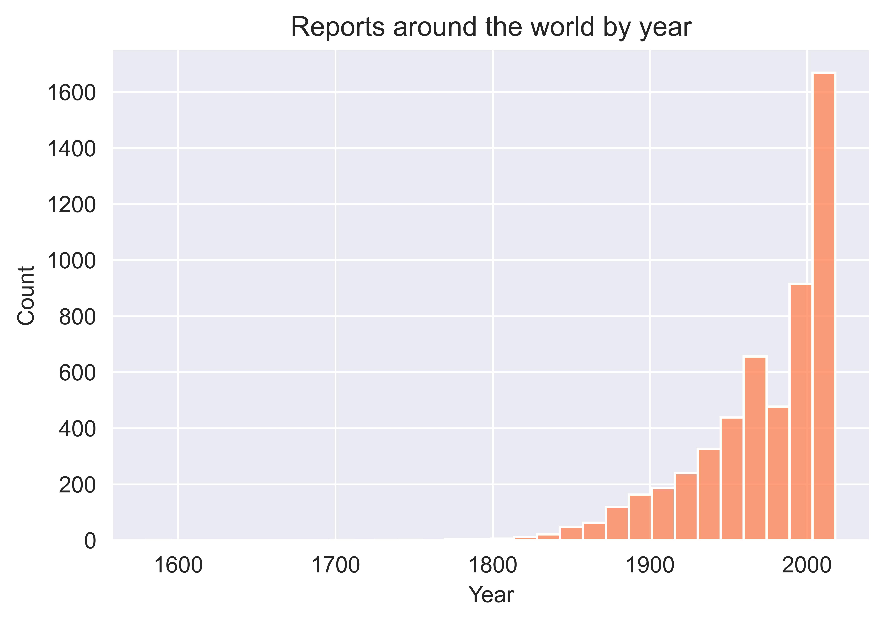
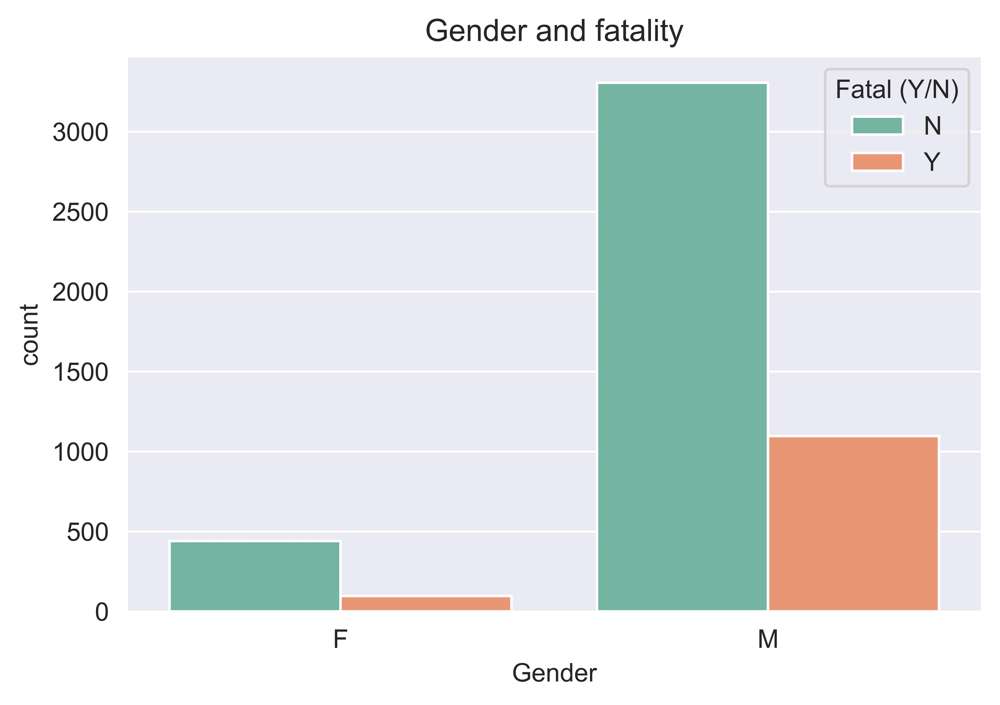

# Project-1
```python
Hello World! This is Marc Planas :)
```
---
## Top-10 (deathliest) activities to avoid during *'Shark Season'* + Climate change
---
The aim of this project was:
1. To identify the top 10 activities (sports) in which most of the shark attacks occur and investigate their survivability.

    > ***Hypothesis:** Since surfing is a very popular sport, most of the reports will be of people practicing it. However, since surfers are very aware of their surroundings, surf might not be the most deathliest activity.*  

2. To identify a so called *'Shark Season'* based on the number of reports per month and country and investigate whether it has changed over the past years. This might give us insights on the migratory patterns of these animals.

    > ***Hypothesis:** Global warming might impact sharks' migratory events in such a way that is reflected in the number attack reports.*

An analysis on the  `sharks.csv` dataset was conducted to investigate these issues. 

---
### 1. Data cleaning
The process described below was performed in the following jupyter notebook: `my_project_cleaning_exploration.ipynb`

The dimensions of the original dataset were: `25723 rows × 24 columns`, and almost all categories (columns) contained `~20,000 NaN` missing values. It also contained `2392 duplicated` reports (rows). Reports with `NaN` values in **all** columns and `duplicated` rows were dropped/removed, lowering the number of rows with potentially meaningful data to `6311`.

After a closer inspection, it was decided to drop some of the categories that would not be useful for the scope of the analysis and which contained repetitive information. Columns dropped were: `pdf`, `href formula`, `href`, `original order`, `Unnamed: 22`, `Unnamed: 23`, `Case Number.1` and `Case Number.2`, lowering the number of columns to `16`. Then, reports in which **half** of the information was missing (i. e. **8** `NaN` values) were also dropped, since they were ruled not reliable. This resulted in a significantly cleaner and more trustworthy dataset, with `6302` reports. In addition, column headers were cleaned using the `strip()` method.

The resulting `(6302 x 16)` dataframe was saved as `sharks_clean.csv` and was used for further exploration and analysis. [^1]

[^1]: The dataset was also cleaned during the analysis stage when aiming at specific categories.

---
### 2. Data exploration
The process described below was performed in the following jupyter notebook: `my_project_cleaning_exploration.ipynb`

An initial exploration was conducted using the `value_counts()` method to see the distribution of values within each column.

In addition, after inspecting the number of `NaN` in each column (the lower the better - more statistically powerfull), the following categories appeared good alternatives to investigate: 
- Date/Year
- Type (out of scope)
- Country/Area/Location
- Activity
- Injury/Fatal (Y/N) a.k.a survivability
- Gender (Sex)

---
### 3. Data analysis
The process described below was performed in the following jupyter notebook: `my_project_analysis.ipynb`

#### 3.1. Top 10 (deathliest) activities
Starting dataset: `sharks_clean.csv`.
Outcome after cleaning and grouping: `sharks_clean_activity_fatal.csv`.

##### 3.1.1. Cleaning Activity
- Removing rows with `NaN` in activity column. Result: `df.shape = (5758, 16)`.
- Cleaning inconsistencies: `lower()`, `strip()`, `replace()`.
- Grouping activities using **RegEx:**
    - Dictionary with RegEx pattern as value.
    - Iterate over the dictionary to `replace()` group similar activities.

```python
dict_activity_regex = {
    "Board surfing" : ".*(surf).*|.*(boogie board).*|.*(body board).*",
    "Kayaking & similar" : ".*(kayak).*|.*(canoe).*|.*(rowing).*",
    "Diving" : ".*(diving).*",
    "Paddle boarding" : ".*(paddle).*",
    "Sailing" : ".*(boat).*|.*(sail).*|.*(ship).*|.*(overboard).*",
    "Snorkeling" : ".*(snorkel).*",
    "Swimming" : ".*(bathing).*|.*(swimming).*|.*(float).*",
    "Spear-fishing" : ".*(spearfishing).*",
    "Fishing" : "[\w\s]+?(fishing).*|^(fishing).*",
    "Wading" : ".*wad.*|.*(walking).*|.*(standing).*|.*(treading).*"
}

for key, value in dict_activity_regex.items():
    sharks_clean["Activity"] = sharks_clean["Activity"].str.replace(value, key, regex = True)
```

##### 3.1.2. Cleaning Fatality
- Removing rows with `NaN` in fatal column. Result: `df.shape = (5344, 16)`.
- Cleaning inconsistencies: `strip()`, `upper()`.
- Removing if value of fatal is not `Y` or `N` using filtering conditions.

##### 3.1.3. Visualization
- Countplot of top 10 activities/sports, using the fatal category as `hue`.
- Image file: `activity_fatality.jpg`


##### Conclusions:
- Although board-related sports represent most of the reports of shark attacks, the fatality concentrates on swimmers, which have less tools to escape the attack or are less aware of their surroundings.
<br/>

#### 3.2. 'Shark Season' by Month and Country
Starting dataset: `sharks_clean.csv`.
Outcome after extracting month and cleaning both month and country: `sharks_clean_month_country.csv`.

##### 3.1.1. Extracting and cleaning Month
- The actual month of the shark attack report was extracted from the `Date` column using the RegEx `-(\w{3})-` and the `extract()` method to create a new `Month` column. 
- When a row did not contain that pattern, the month was filled with `NaN`. Out of the `6302` initial rows, `910` contained missing values now. I was willing to sacrifice this rows, since they either did not contain the month or the annotation was deemed unreliable (i. e. "It happened after August 1800"). 
- Rows with `NaN` in the `Month` column were removed, resulting in `5392` shark attack reports.

For visualization purposes, months were then encoded using numbers `1-12`. Otherwise they would be ordered alphabetically in the x-axis of the plot.

##### 3.1.2. Cleaning Country
- Rows with `NaN` in Country were removed. Result: `df.shape = (5361, 17)`.
- Unique countries were checked to see inconsistencies.
- The top 3 countries (USA, Australia, South Africa) were selected as they represent most of the reports.

##### 3.1.3. Visualization: 'Shark Season'
- Defined filtering conditions for each Country.
- Report counts were plotted `groupby` month.
- Image file: `shark_season_countries.jpg`.


##### Conclusions:
- *'Shark Season'* actually reflects summer season in the northern hemisphere (USA) and southern hemisphere (Australia, South Africa). :upside_down_face:
- Most reports are observed during summer season due to people practicing  sea-related activities.
<br/>

#### 3.3. 'Shark Season' by Country and Year - Climate Change (?)
*'Shark Season'* might have looked different in the past due to:
- **Climate change / global warming**.
- Increased ease to report attacks.

Starting dataframe: `sharks_clean_month_country.csv`
Outcome after cleaning the year: `sharks_clean_month_country_year.csv`

##### 3.3.1. Cleaning Year
- The `Year` column was cleaned after checking `unique()` values:
```python
try:
    sharks_clean["Year"] = sharks_clean["Year"].astype(int)
except Exception:
    sharks_clean['Year'] = sharks_clean['Year'].fillna(0).astype(int)
```
- Rows with `NaN` in `Year` were removed. Result: `df.shape = (5352, 17)`.

##### 3.3.2. Visualization: Worlwide reports
- Worldwide reports were visualized using a histplot.
- Image file: `shark_reports_year.jpg`.



##### Conclusions:
- Most reports occur since year 1900, mainly due to increased ease in documenting the attacks (probably). Thus, in order to have more powerful data (the more reports the better) it makes sense to focus in this last century.
<br/>

##### 3.3.3. Visualization: Evolution of attacks in USA in the last century
- A new dataframe was created (`sharks_clean_month_year_usa.csv`) selecting only those reports belonging to USA using filtering conditions. Result: `df.shape = (2049, 17)`.
- Report were plotted `groupby` month and filtering each plot by spans of 20 years, from 1920 to 2018.
- Image file: `month_year_USA.jpg`.


##### Conclusions: 
- Since the last 20-40 years concentration of attack reports seems to start earlier (from Apr) and lasts longer in time (till Oct). This could be due to:
    - Ease to report cases.
    - Summer season starts early due to **global warming**, leading to more attacks.
<br/>

##### 3.3.4. Visualization: Evolution of attacks in Australia in the last century
- A similar process was followed for the second country with most reports and which is located in the southern hemisphere, Australia. The dataframe was saved as: `sharks_clean_month_year_australia.csv`.
- Image file: `month_year_australia.jpg`.


##### Conclusions:
- Similar to USA, an increase in reports during *'winter'* months is observed in the last 20 years. **Global warming** is not a hoax!
<br/>

#### 3.4. Demographics
Finally, some demographic investigation were conducted in order to visualize which age and gender accumulated more fatality reports.

##### 3.4.1. Age x Survivability
Starting dataframe: `sharks_clean_activity_fatal.csv`.
- 2180 rows with `NaN` age were removed.
- Cleaned inconsistencies: `.map(str)`, followed by `strip()`.
- **RegEx** was used to extract the age: `(\d{1,2})`.
- New `NaN` that did not follow this pattern (26) were removed.
- Ages were transformed back to `int` using `map`.
- Age distribution was plotted using a violin plot and fatality was shown in the y-axis.
- Image file: `age_fatality.jpg`.


##### 3.4.2. Gender x Survivability
Starting dataframe: `sharks_clean_activity_fatal.csv`.
- 362 rows with `NaN` gender were removed.
- Cleaned inconsistencies: `strip()`.
- Only those that contained a value of `M` or `F` were kept.
- Gender counts were plotted using a countplot and fatality was shown in the y-axis.
- Image file: `gender_fatality.jpg`.


